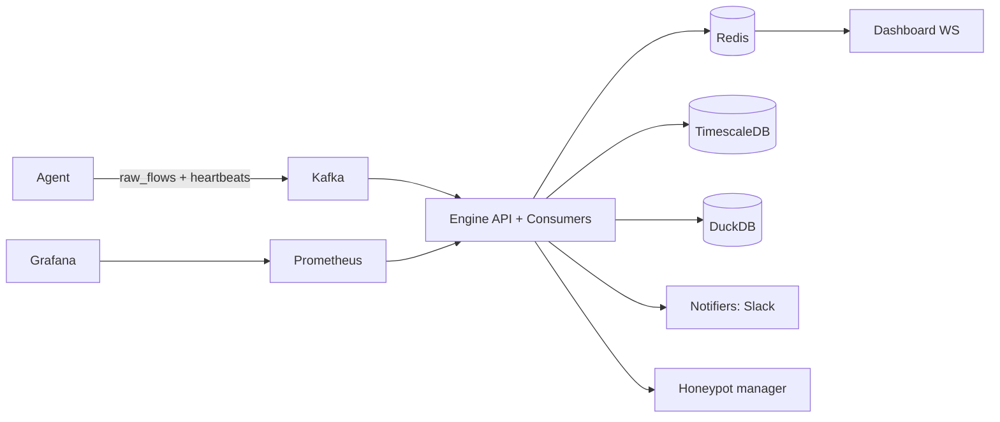

# NetGuardian 2.0

Architektura (skrót): `agent -> Kafka -> engine(FastAPI + detection + response) -> Redis + TimescaleDB + DuckDB -> dashboard`.

## Architektura (Mermaid)



## Szybki start

1. Skopiuj plik środowiskowy:
   ```bash
   cp .env.example .env
   ```
2. Uzupełnij sekrety (minimum: AbuseIPDB/Slack opcjonalne, MISP opcjonalny).
3. Przygotuj klucze SSH automatycznie:
   ```bash
   ./scripts/setup_local_prereqs.sh
   ```
4. Dodaj plik GeoIP ręcznie:
   - `engine/ssh/id_rsa`
   - `agent/authorized_keys`
   - `engine/data/GeoLite2-City.mmdb`
5. Zweryfikuj wymagane pliki runtime:
   ```bash
   ./scripts/validate_runtime_prereqs.sh
   ```
6. Uruchom:
3. Dodaj pliki kluczy i GeoIP:
   - `engine/ssh/id_rsa`
   - `agent/authorized_keys`
   - `engine/data/GeoLite2-City.mmdb`
4. Uruchom:
   ```bash
   docker compose up --build
   ```

## Tryb developerski

Repo zawiera `docker-compose.override.yml` z hot-reloadem dla engine (`uvicorn --reload`).

```bash
docker compose up --build
```

## Endpointy API (przykłady)

```bash
# token
curl -X POST http://localhost:8000/token \
  -H "Content-Type: application/x-www-form-urlencoded" \
  -d "username=viewer&password=viewer123"

# status (wstaw token)
curl http://localhost:8000/status -H "Authorization: Bearer <TOKEN>"

# unblock
curl -X POST http://localhost:8000/unblock/192.168.1.10 -H "Authorization: Bearer <TOKEN_ADMIN>"

# raport PDF
curl -L http://localhost:8000/report -H "Authorization: Bearer <TOKEN>" -o netguardian_report.pdf
```

WebSocket alertów:
- lokalnie: `ws://localhost:8001/ws`
- wewnątrz sieci compose: `ws://engine:8000/ws`

## Testy

```bash
cd netguardian
pytest -q
```

## Symulacja ataków i testy integracyjne

Gotowe skrypty i scenariusze:
- `scripts/attacks/ddos_syn_flood.sh`
- `scripts/attacks/port_scan.sh`
- `scripts/attacks/dns_tunnel_sim.py`
- `scripts/attacks/ssh_bruteforce.sh`
- pełny opis: `docs/integration-tests.md`

## Monitoring

- Prometheus: `http://localhost:9090`
- Grafana: `http://localhost:3000` (`admin/admin`)
- przykładowy dashboard JSON: `grafana/dashboards/netguardian-overview.json`

## Moduły detekcji / reakcji

- `engine/detection/beacon_detector.py`
- `engine/detection/dns_analyzer.py`
- `engine/detection/exfiltration.py`
- `engine/correlation/correlator.py`
- `engine/reputation/scorer.py`
- `engine/response/executor.py`


## Dodatkowe docs
- `docs/integration-tests.md`
- `docs/modules/detection-response.md`

## Demo wideo (checklista 3-4 min)
1. `docker compose up --build` i pokaz startu usług.
2. Dashboard pusty + uruchomienie ataku (`ddos_syn_flood.sh`).
3. Alert na WS, wpis blokady (`/status`), log `Blocking IP ...`.
4. `GET /report` + podgląd Grafany z `netguardian_agents_online`.


## Playbooki reakcji
- Definicje playbooków: `engine/response/playbooks/*.yml`.
- Silnik wykonawczy: `engine/response/executor.py`.
- Aby dodać własny playbook: dodaj nowy plik YAML z warunkami i akcjami, a następnie zrestartuj `engine`.

## Raport PDF
- Endpoint: `GET /report` (wymaga tokenu).
- Generator: `engine/report/generator.py`.
- Przykład: `curl -L http://localhost:8000/report -H "Authorization: Bearer <TOKEN>" -o netguardian_report.pdf`.


## Znane ograniczenia
- Wymagany ręczny plik GeoIP: `engine/data/GeoLite2-City.mmdb`.
- Honeypot manager używa Docker socket (`/var/run/docker.sock`) i jest przeznaczony do środowisk dev/lab.
- Agent generuje ruch symulowany; brak eBPF/nDPI w tej wersji.
